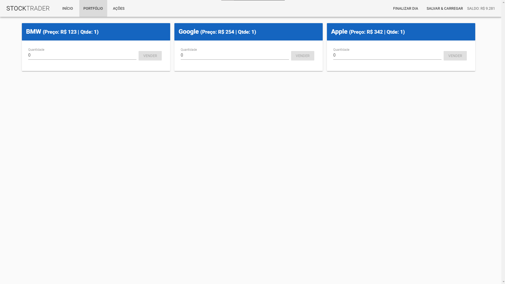

# Stock-Trader

Aplicação para compras e vendas de ações.

# Recursos

* O aplicativo foi desenvolvido com Vue.js, VueX, Vue.router, Vuetify, JavaScript, CSS, HTML, Axios, stylus, API.

# Uso

1. Clone o repositório do GitHub.
2. Abra o projeto no seu editor de código.
3. Instale o pacote do projeto com npm install.
3. Starte o projeto com npm run serve.

# Créditos

Este projeto foi criado por Alaska Websites.